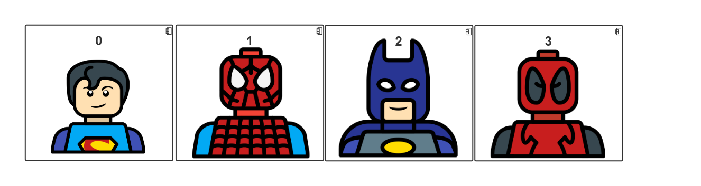

# Data Structures

## Array Basics

A common data structure buily into nearly every programming language is the array. Arrays are a fundamental data structure, and can be used to represent a collection of values.


## Arrays

An array is a data structure that stores a collection of values of the same type. You access each individual value through an integer index.


Declare an array variable by specifying the array type - which is the element type followed by [] - and the array variable name 

Java

```java
int[] arr = new int[100];

```

Python

```python
arr = list()
```

Can you Identify the differences ?


## Strongly Typed 

In most languages like C++, Java, and Swift arrays are considered to be homogeneous containers.

> Homogeneous - 1: of the same kind or a similar kind or nature ; of uniform structure or composition;

Java being a strongly typed language, to enforce type safety, containers in Java all must old objects of the same type. In this case all the characters are of type Marvel.


## Dynamically Typed

In other languages like Python and Java Script, arrays are heterogeneous structures that can store any kind of value. So in Python below you can have values from both DC and Marvel in the same container. As well as in a more practical sense Numbers, and Strings.




 The List datastructure in python is closer to a traditional array

> Heterogeneous - 1: diverse in character or content;


## How Arrays work
### Strongly typed languages


Data is stored contigously, and stored in blocks of memory that are right next to each other.


## How Arrays work
### Dynamically typed languages

Data is non-contingous and data needs to be accessed through a reference / pointer. this process does add overhead.


## Python

Python defines both an array and a list type and while they look and feel similar to one another they have their own uses. The array.array class in Python is a thin wrapper around a C array and this introduces some limitations. For example, Python arrays are homogeneous and can only hold data of a single kind. The type does take up much less space in memory than Python lists however so in general you would use an array if space was a concern or if you wanted to expose some C functionality.

As mentioned in the course, Python lists are the more frequently used type and the de facto representation of an array like structure. They are a heterogeneous and contiguous data structure.


## Java

Arrays in Java are represented by the Array class and is a homogeneous container containing a fixed number of values of a single type. Two types of arrays can be created - one containing primitive values like int or char or ones that contain objects by means of references or pointers.

To declare a variable to refer to an array the type must be specified.

```
// declares an array of integers
int[] anArray;
```
Declaring an array does not actually create the array, instead it indicates that the variable holds an array of the type that we specify. When an array is created the variable anArray holds a reference to the location in memory where the array is stored.

When arrays of primitive values are created, the values are stored in the array. For objects however, the array contains references to the locations in memory where the objects are stored.


## JavaScript

JavaScript does not have an explicit array data type and arrays are represented by the Array object which is a list like object. Array is an Object type with special constructor and accessor methods. Its prototype has methods to perform traversal and mutation operations.

JavaScript arrays are heterogeneous, meaning the types of elements are not fixed and neither is the size. Unlike the description given in the course video, arrays in JavaScript are not contiguous data structures and the data stored in the array can be located in a non-contiguous location.

There are several ways to create an array:

```
var arr = new Array(1);
var arr = Array(1);
var arr = [1];
```


## Common Operations of Data Structures

* Access and read values
* Search for an arbitrary value
* Insert values at any point into the structure
* Delete values in the structure


## Space = n * m


# Lab
## Lets create a linked list

A linked list is a data structure made of a chain of node objects. Each node contains a value and a pointer to the next node in the chain.

Linked lists are preferred over arrays due to their dynamic size and ease of insertion and deletion properties.

The head pointer points to the first node, and the last element of the list points to null. When the list is empty, the head pointer points to null.


### Linked List


## Singly linked list

Original Python does not ship with a built-in linked list data structure like the one seen in Java.

Let’s see how we can create our own implementation of a standard class-based singly linked list in Python.

### 1. Start with a single node
Let’s start with a single node since linking several nodes gives us a complete list. For this, we make a Node class that holds some data and a single pointer next, that will be used to point to the next Node type object in the Linked List.

Create a workspace on Repl. it
[Click this link and FORK it!](https://repl.it/@CodeRhino/FragrantOriginalAdaware#main.py)

Then paste this code in: 

```
# A single node of a singly linked list
class Node:
  # constructor
  def __init__(self, data, next=None): 
    self.data = data
    self.next = next

# Creating a single node
first = Node(3)
print(first.data)
```

### 2. Join nodes to get a linked list 

The next step is to join multiple single nodes containing data using the next pointers, and have a single head pointer pointing to a complete instance of a Linked List.

Using the head pointer, we will be able to traverse the whole list, even perform all kinds of list manipulations while we are at it.

For this, we create a LinkedList class with a single head pointer:

```
# A Linked List class with a single head node
class LinkedList:
  def __init__(self):  
    self.head = None

# Remove this and replace with below
first = Node(3)
print(first.data)

# Linked List with a single node
LL = LinkedList()
LL.head = Node(3)
print(LL.head.data)
```

### 3. Add required methods to the LinkedList class

Last but not least, we can add various linked list manipulation methods in our implementation.

Let’s have a look at the insertion and print methods for our LinkedList implementation below:

```
# insertion method for the linked list class
  # insertion method for the linked list
  def insert(self, data):
    newNode = Node(data)
    if(self.head):
      current = self.head
      while(current.next):
        current = current.next
      current.next = newNode
    else:
      self.head = newNode
  
  # print method for the linked list
  def printLL(self):
    current = self.head
    while(current):
      print(current.data)
      current = current.next

# Remove this and replace with below 
LL = LinkedList()
LL.head = Node(3)
print(LL.head.data)

# Singly Linked List with insertion and print methods
LL = LinkedList()
LL.insert(3)
LL.insert(4)
LL.insert(5)
LL.printLL()
``` 

## Challenge

You now have a method for inserting a node its time to add two more methods:

1. Add a method to search for a value
2. Add a method to remove a value
